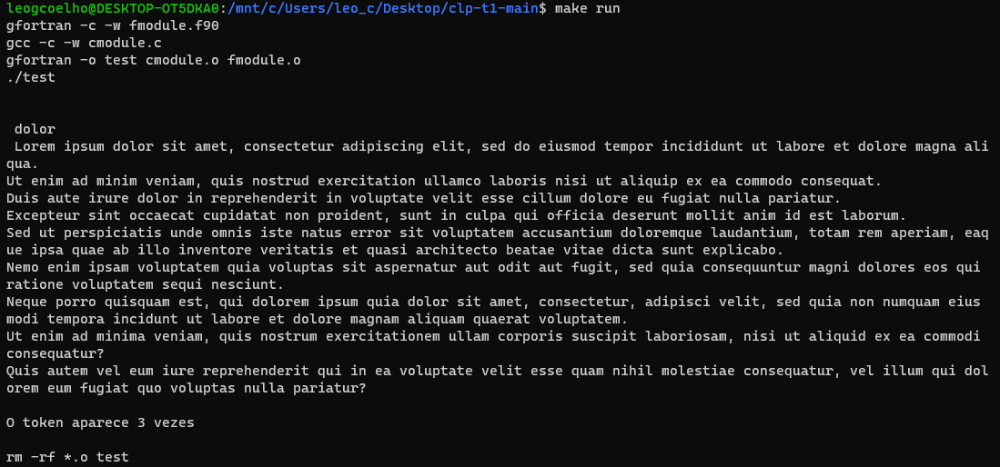

# Trabalho 1 de Conceitos de Linguagem de Computador

Esse trabalho consiste na implementação de uma função que identifica uma string na primeira linha de um arquivo de texto. Um algoritmo deve então contabilizar quantas vezes essa string aparece no restante do texto.

A leitura do arquivo, validação da entrada, e a impressão do resultado foram implementados na liguagem C, enquanto o algoritimo de contar as palavras foi implementado em Fortran.

## Problemas encontrados e soluções

Os principais problemas identificados na implementação desse trabalho estão relacionados à comunicação entre as linguagens C e Fortran, através da função `bind (C)`. Os problemas vieram principalmente da pouca documentação sobre esse assunto disponível na internet. No fim, os problemas foram resolvidos de acordo com as páginas apresentadas nas referências.

## Exemplo de execução

Para executar o exemplo é necessário executar os comando `test` e `run` do Makefile.

```bash
$ make test
$ make run
```



## Integrantes

- Arthur Alves Cerveira
- Cassio Fehlberg Lemos
- Leonardo Gularte Coelho

## Referências

- [Standard Fortran and C Interoperability](https://scc.ustc.edu.cn/zlsc/chinagrid/intel/compiler_f/main_for/GUID-C0FA4080-4548-4045-9E6D-EFE57A0DE1A3.htm)
- [Interoperability with C](https://gcc.gnu.org/onlinedocs/gfortran/Interoperability-with-C.html)
- [iso_c_binding](http://fortranwiki.org/fortran/show/iso_c_binding)
